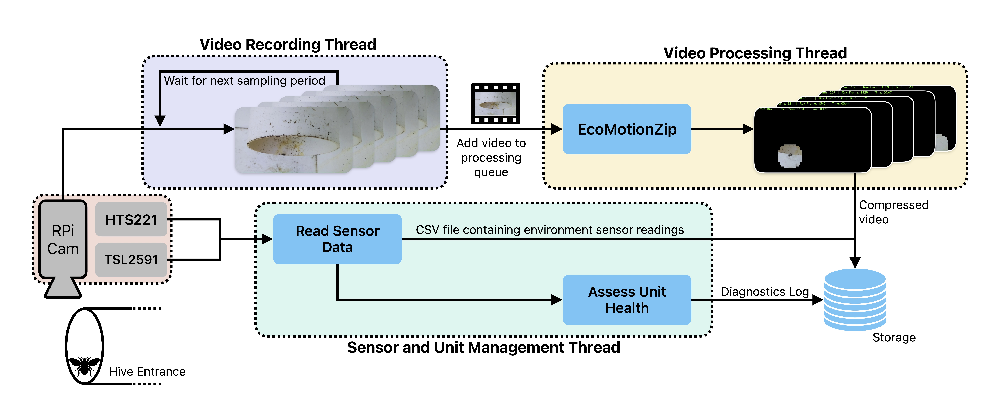

# BEElogger
[](https://choosealicense.com/licenses/gpl-3.0/)

**B**eehive **E**ntrance and **E**nvironment Logger *(BEElogger)* is a Raspberry Pi-based system designed for recording video and micro-climatic data at the entrance of a beehive. The BEElogger system is specifically tailored for monitoring stingless bees and assisting beekeepers in observing the activity and environmental conditions of their beehives. By utilising a Raspberry Pi, the system captures video footage and collects data on temperature, humidity, pressure, and light intensity, all of which are relevant to bee activity. This information can be used to analyse the health and behaviour of the bee colony, detect potential issues early, and make informed decisions to improve hive management.

### Features

- High-definition video recording of beehive entrance activity.
- Real-time monitoring of temperature, humidity, pressure, and light intensity.
- Data logging for historical analysis.
- Easy setup and configuration with a Raspberry Pi.
- Open-source software for customization and extension.
- Support for EcoMotionZip software for video compression to optimise storage resources on the Raspberry Pi.
- Automatic processing of recorded videos using BEETrack software, which leverages AI and deep learning to analyse bee activity.

## Methodology

The BEElogger uses a Raspberry Pi 4-based system to record video and microclimatic data. The system consists of the following components:

- [**Raspberry Pi 4 Model B**](https://www.raspberrypi.com/products/raspberry-pi-4-model-b/): The main processing unit that runs the BEElogger software.
- [**Raspberry Pi Camera Module v2**](https://www.raspberrypi.com/products/camera-module-v2/): A high-definition camera connected to the Raspberry Pi for recording video at the beehive entrance.
- [**Adafruit HTS221**](https://www.adafruit.com/product/4535): Measures the temperature, humidity and pressure levels at the beehive entrance.
- [**Adafruit TSL2591**](https://www.adafruit.com/product/1980): Captures data on the light conditions around the beehive.
- **MicroSD Card**: Used for storing the operating system, software, and recorded data.
- [**Power Supply**](https://www.raspberrypi.com/products/type-c-power-supply/): Provides power to the Raspberry Pi and connected components.
- **Enclosure**: Protects the Raspberry Pi and sensors from environmental elements.

The data collection methodology of the BEElogger system leverages Python's multi-threading capabilities to perform parallel tasks simultaneously. An overview of the data collection pipeline is shown in Figure 1. The BEElogger uses EcoMotionZip software to compress recorded videos before storage, optimising the limited storage capacity of the Raspberry Pi. Users can choose to disable video compression if desired. Additionally, users can customise data sampling durations and intervals, specifying how long videos should be recorded at each interval. They can also set the video sampling hours to capture periods of peak activity. Microclimatic data is collected continuously, 24 hours a day, regardless of the specified video recording durations.


*Figure 1: Overview of the BEElogger Data Collection Pipeline*

### Repository Structure


```

### Installation

To install and set up the BEElogger system, follow these steps:

1. Clone the repository:
    ```bash
    git clone https://github.com/yourusername/NatBeeSense.git
    ```
2. Navigate to the project directory:
    ```bash
    cd NatBeeSense
    ```
3. Install the required dependencies:
    ```bash
    sudo ./install_dependencies.sh
    ```
4. Configure the system settings in the `config.json` file.
5. Run the BEElogger software:
    ```bash
    python3 bee_logger.py
    ```

### Usage

Once the system is set up, it will automatically start recording video and logging environmental data. You can access the recorded data and video files in the designated output directory specified in the configuration file.

### Contributing

We welcome contributions to the BEElogger project. If you have any ideas, suggestions, or bug reports, please open an issue or submit a pull request on GitHub.

### License

This project is licensed under the MIT License. See the `LICENSE` file for more details.
